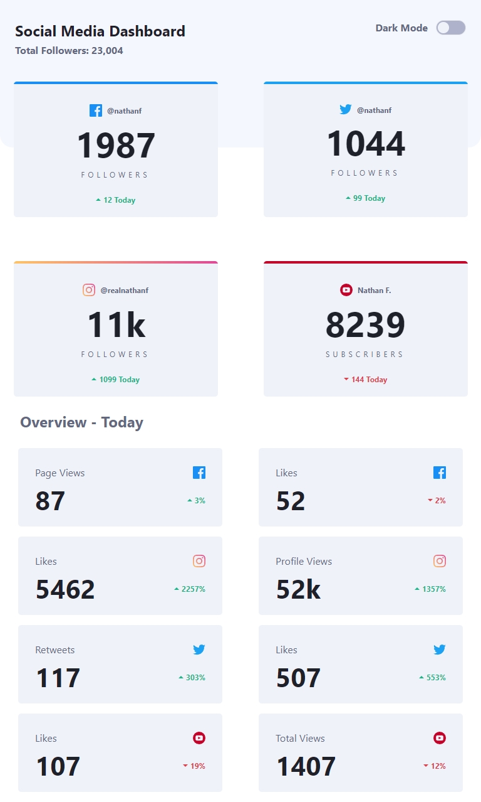

 
  <h1>Social Media Dashboard with Theme Switcher</h1>

 
  
   
  
  
  
  
  

## Description

This project is a social media dashboard that allows users to view their followers/subscribers on various platforms such as Facebook, Twitter, Instagram, and YouTube. Additionally, it provides insights into today's statistics like page views, likes, retweets, etc. The dashboard also includes a theme switcher that toggles between light and dark themes.

## Key Features

- View follower/subscriber counts for Facebook, Twitter, Instagram, and YouTube.

- See today's statistics including page views, likes, retweets, etc.

- Toggle between light and dark themes for better user experience.

- Responsive design ensures optimal viewing on various devices.

## Screenshots

  
    
   
     
   

## Additional Information

- Data for the dashboard was provided by a JSON file.
- Icons used in the project are sourced from [iconfinder.com](https://www.iconfinder.com/).

Check out the live project: [Social Media Dashboard with Theme Switcher](https://social-media-dashboard-with-theme-switcher-ruby.vercel.app/)
